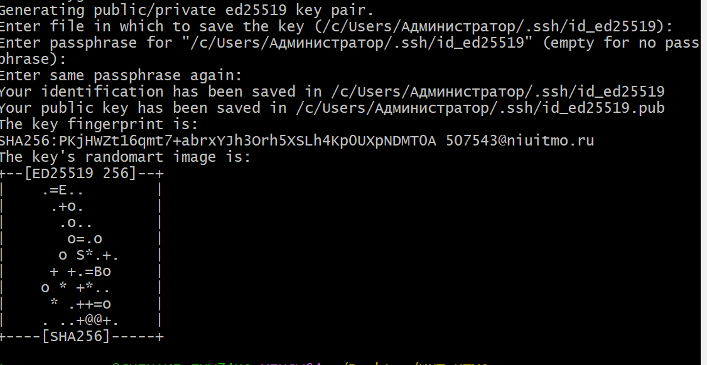
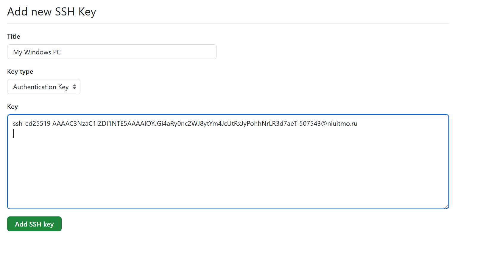
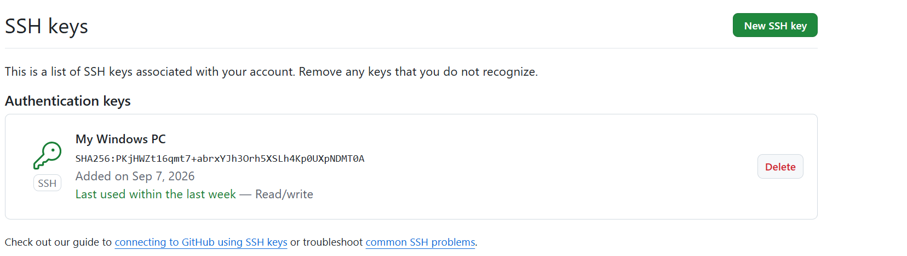
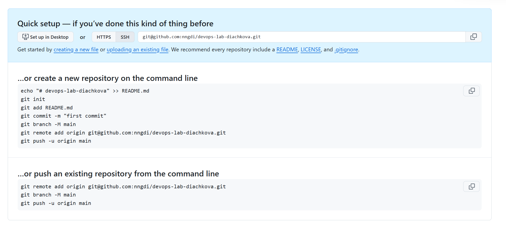
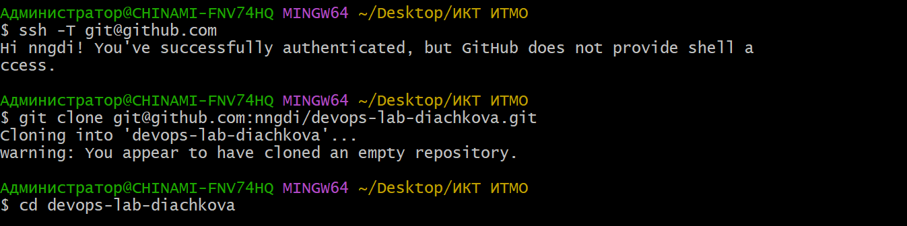
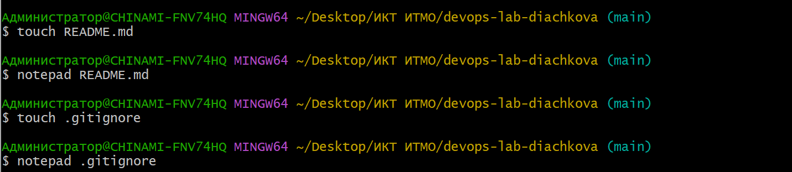
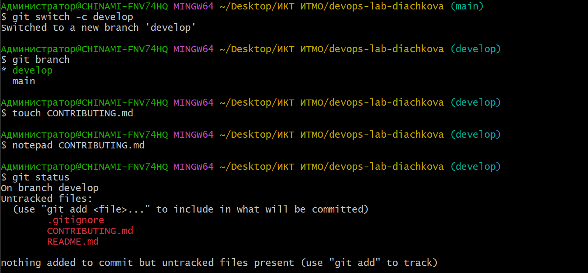
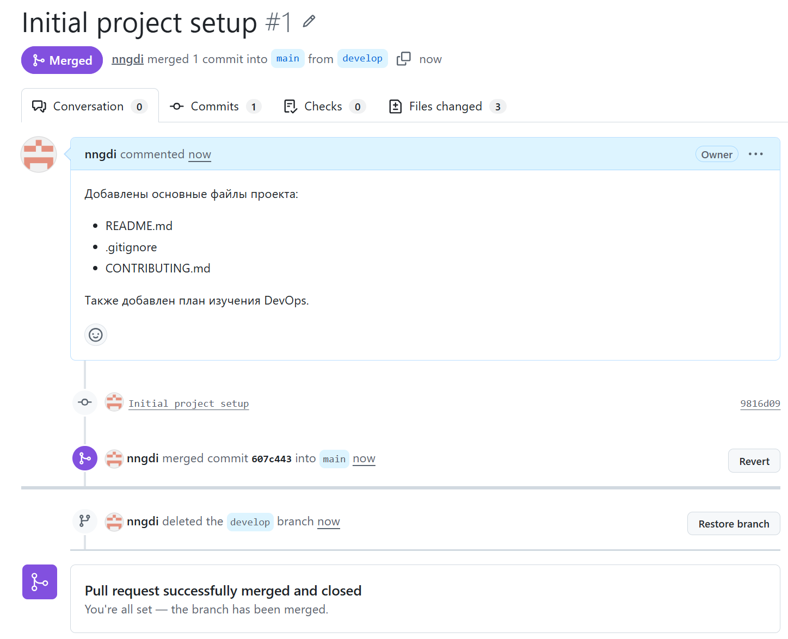
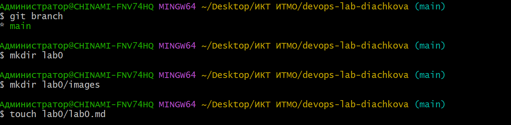
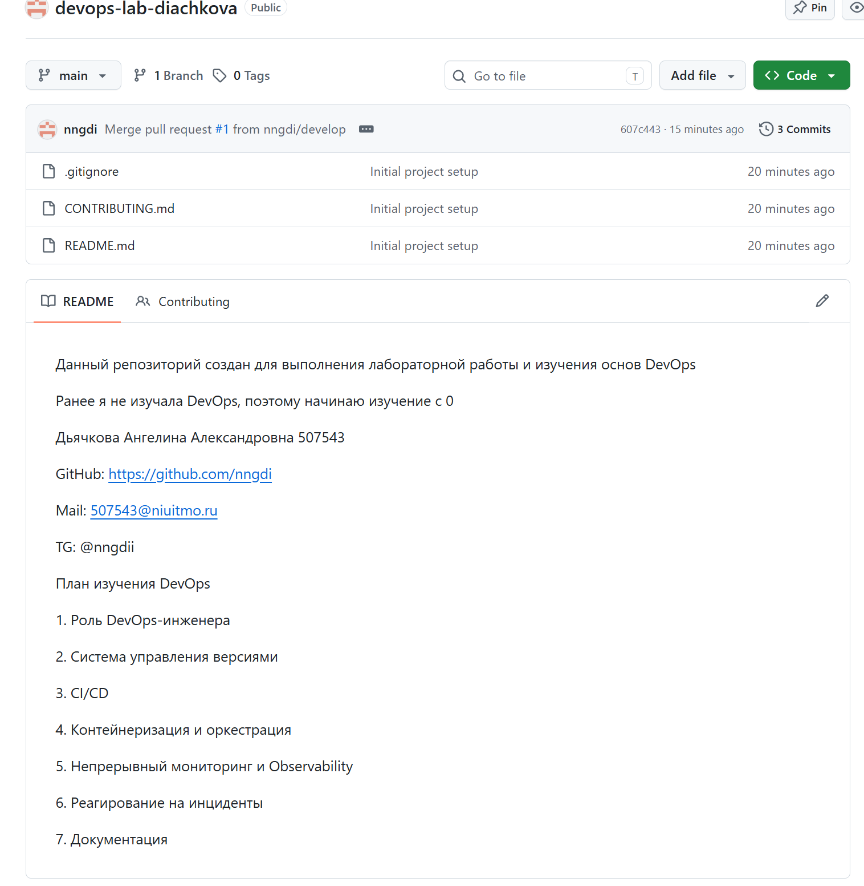

1. Настройка SSH-ключа

SSH-ключа ранее не было, поэтому был создан новый ключ типа ED25519 для работы с GitHub.

2. Создание репозитория

На GitHub был создан публичный репозиторий `devops-lab-diachkova`.

Для подключения к репозиторию использовался SSH.

3. Проверка SSH и клонирование репозитория

Подключение к GitHub было проверено командой:

`ssh -T git@github.com`

Аутентификация прошла успешно.

После этого репозиторий был склонирован на компьютер с помощью команды `git clone`.

4. Создание README.md и .gitignore

Был создан файл `README.md` с описанием проекта, контактными данными и планом изучения DevOps.

Также был создан файл `.gitignore` со стандартными исключениями для операционной системы Windows.

5. Создание ветки develop и CONTRIBUTING.md

Была создана новая ветка `develop` и выполнено переключение на неё.

Также был создан файл `CONTRIBUTING.md` с правилами участия в проекте.

Командой `git status` была выполнена проверка созданных файлов.

6. Коммит, Pull Request и Merge

Созданные файлы были добавлены в индекс и сохранены в коммите с сообщением:

`Initial project setup`

После отправки ветки `develop` на GitHub был создан Pull Request из `develop` в `main`.

Pull Request был успешно объединён с веткой `main`, после чего ветка `develop` была удалена.

7. Проверка веток и создание отчёта

После завершения слияния была выполнена проверка локальных веток. В проекте осталась основная ветка `main`.

Для отчёта была создана папка `lab0`, папка `images` и файл `lab0.md`.

8. Результат работы

В результате лабораторной работы был создан и настроен GitHub-репозиторий `devops-lab-diachkova`.

В основной ветке `main` находятся файлы:

- `.gitignore`

- `CONTRIBUTING.md`

- `README.md`

В файле `README.md` содержится описание проекта, контактные данные и план изучения DevOps.

Вывод

В ходе лабораторной работы была выполнена настройка SSH для GitHub, создан и склонирован репозиторий, освоена работа с ветками, индексом, коммитами и Pull Request. Также были созданы основные файлы проекта и выполнено слияние ветки `develop` с `main`.

